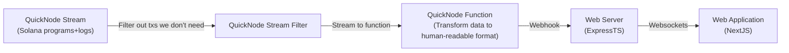

# Katlog - Solana Transaction Monitoring System

## Overview

Katlog is a sophisticated monitoring system built to track account transactions on Solana in real-time using QuickNode's streams.

## Technical Architecture

### QuickNode Integration

The system leverages QuickNode's streams to obtain realtime data on program invocations on the Solana blockchain. This enables:

- Real-time transaction monitoring
- Low-latency data retrieval
- Efficient webhook-based notifications

### Webhook Implementation

The webhook system is configured to:

1. Listen for specific Solana account activities
2. Process incoming transaction data
3. Trigger appropriate actions based on transaction patterns

### Data Flow



## Project Structure

```
📁 client/
├── 📁 public/              # Static public assets
├── 📁 src/                 # Source code directory
│   ├── 📁 app/            # Main application code
│   ├── 📁 components/     # Reusable UI components
│   ├── 📁 hooks/          # Custom React hooks
│   ├── 📁 lib/            # Utility libraries and functions
│   ├── 📁 models/         # Data models and types
│   ├── 📁 providers/      # React context providers
│   ├── 📁 styles/         # CSS and styling files
│   ├── 📁 types/          # TypeScript type definitions
│   └── 📁 utils/          # Helper functions and utilities
├── 📄 .env                # Environment variables
├── 📄 .env.example        # Example environment configuration
├── 📄 .gitignore         # Git ignore rules
├── 📄 components.json    # Component configuration
├── 📄 eslint.config.mjs  # ESLint configuration
├── 📄 next-env.d.ts      # Next.js TypeScript declarations
├── 📄 next.config.ts     # Next.js configuration
├── 📄 package.json       # Project dependencies and scripts
├── 📄 pnpm-lock.yaml     # PNPM lock file
├── 📄 postcss.config.js  # PostCSS configuration
├── 📄 README.md          # Project documentation
├── 📄 tailwind.config.ts # Tailwind CSS configuration
├── 📄 tsconfig.json      # TypeScript configuration
└── 📄 types.d.ts         # Global type declarations
📁 server/
├── 📁 src/               # Source code directory
│   ├── 📁 config/       # Configuration files
│   ├── 📁 core/         # Core application logic
│   ├── 📁 middlewares/  # Express middleware functions
│   ├── 📁 modules/      # Feature modules
│   ├── 📁 types/        # TypeScript type definitions
│   ├── 📁 utils/        # Helper functions and utilities
│   ├── 📄 index.ts      # Main application entry point
│   ├── 📄 .env              # Environment variables
│   ├── 📄 .env.example      # Example environment configuration
│   ├── 📄 .eslintrc.js      # ESLint configuration
│   ├── 📄 .gitignore        # Git ignore rules
│   ├── 📄 package.json      # Project dependencies and scripts
│   ├── 📄 pnpm-lock.yaml    # PNPM lock file
│   └── 📄 tsconfig.json     # TypeScript configuration
│
├── 📄 Makefile          # Build and development scripts
└── 📄 README.md         # Project documentation
```

## QuickNode Function

Visit this [Github Gist](https://gist.github.com/Leeyah-123/98031b6fbf39b1fb2570c92e1a7b2df1) to view the QuickNode function for transforming the Solana Programs+Logs data.
You can copy and paste this into the QuickNode functions editor and connect your stream to it.
Make sure to update the webhook URL to point to your webhook.

## Getting Started

### Prerequisites

- Node.js >= 16.x

### Installation

```bash
git clone https://github.com/Leeyah-123/katlog.git
cd katlog
make install
```

### Environment Setup

```bash
cp client/.env.example client/.env
cp server/.env.example server/.env
```

Update the environment variables for both client and server

### Running the Application

- Client

  ```bash
  pnpm dev     # Development mode
  pnpm build   # Production build
  pnpm start   # Start production server
  ```

- Server
  ```bash
  pnpm dev     # Development mode
  pnpm build   # Production build
  pnpm start   # Start production server
  ```
